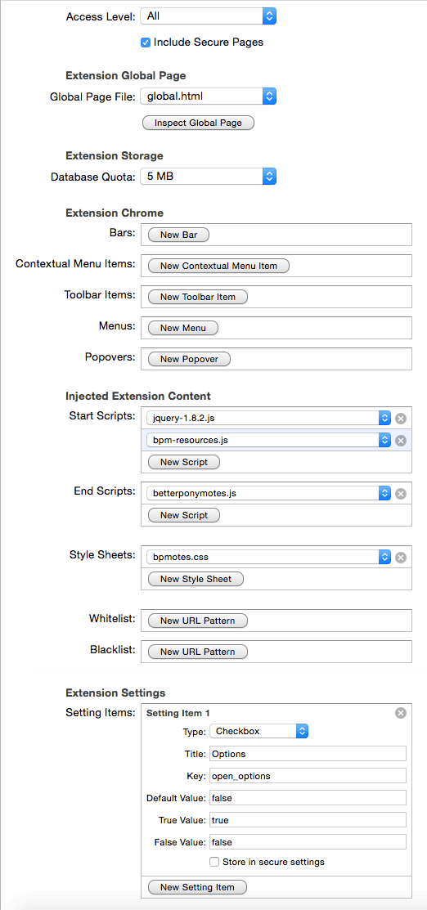

# BetterPonymotes-for-Safari
A port of the popular reddit pony emote viewer BetterPonymotes created by /u/Typhos. It runs natively on Safari, as oposed to the userscipt that it used to be.
There is a lot that is untested about this release, but so far, I haven't noticed any issues that I haven't already fixed, but if you see something, please report it with the bug tracker.

## Building
Unfortunately, there isn't an easy way to build it, seeing as it requires Safari's Extension builder, but I'll include a screencap of the settings below that are required to build it.
Also, you will need a valid Safari Developer Certificate (don't worry, they're free).

